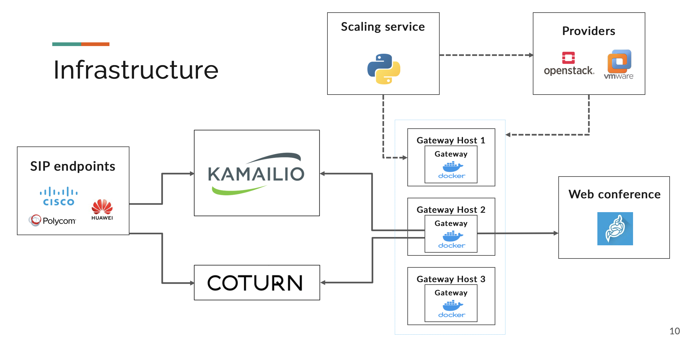
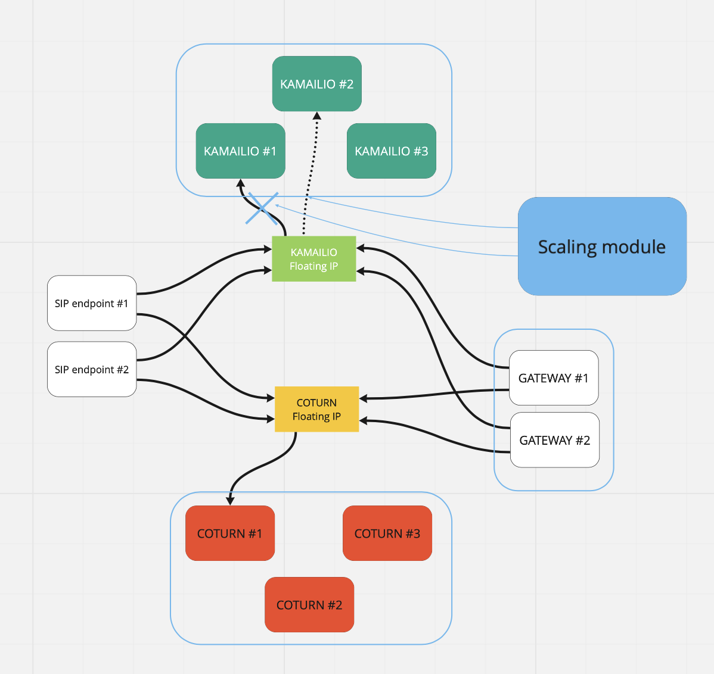

# SIPMediaDeploy in depth
This document will aim to bring more information about the SIPMediaDeploy project .

# Presentation

This project aims to implement automatic deployement and auto scaling for the [SIPMediaGateway](https://github.com/Renater/SIPMediaGW). The SIPMediaGateway project was put in place in order to develp a solution that allows SIP terminals to participate in WEBRTC calls (in this case Jitsi webconferences). This solution was developped by [Renater](https://github.com/Renater) and this repository uses the source code to implement automatic deployment and scaling on an Openstack environment.

# Initial Infrastructure

The initail infrastructure for the SIPMediaGAteway is detailed in the following schema :

We can see that there is 3 important parts:
* the **SIP server**, the Kamailio server in this case.
* the **TURN server**, the Coturn server.
* the **Gateway server**, the server that containes the docker basehd media gateway.

In the rest of the project, a choice was made to deploy only one media gateway per GatewayHost server, but this can be easily changed using environement variables.

In this project we implement automatic deployment for the whole infrastructure with autoscaling for the GatewayHosts using a scaling module, later on we add redondence for the Kamailio and Coturn server as well as the scsling module.

# Automatic deployement and autoscaling

## Automatic Deployment

After extensive discussions, these technologies were agreed upon as follows:
* **Ansible** for the configuration of virtual machine images.
* **Packer** for building said images and pushing then to Openstack working environment.
* **Terraform** for the deployment for the whole infrastructure.

The exact worflow for the deployment is detailed in the following schema:

We can see that to deploy the whole infrastructure we need to:
* Build docker images for the Gateway and the Scaler and push then to Dockerhub.
* Build virtual machine images using Packer and Ansible.
* Deploy the infrestructure using Terraform.

The commands to use are in the READMEs of each directory of the project.

Note: the ansible playbooks can be used independently to provisions virtual machines for a more custom configuration.

## Autoscaling

For this project we needed a module to create the GaterwayHost machines automatically in order to have at a any given moment
a given number Gateway that are ready and on standby to take calls. For this, we chose to developp our own custom module that can be used with multiple providers. This module is the [SimpleScaleVM](https://github.com/Renater/SimpleScaleVM).To learn more about this custom module please visit this [more-in-depth document](https://github.com/Renater/SimpleScaleVM/tree/add-autoscaling-docs).

Once deployed we should obtain this .

# Redondence

Seeing the crucial role played by both the Kamailio and the Coturn server, a more resilient infrastructure is needed to garantee a minimal downtime in the case of an accident. For this, each brick of the infrusture was multiplied and a floating IP system was implemented to ensure successful failover.

For example, two instances of Kmailio servers are deployed with the same configuration. The main server has the flating IP address attached to it and the scaling module makes sure that this server is always alive and working. In the case of an issue (Kamailio service shutting down for example), the scaling module detaches the floationg IP from the faulty instance to the one on standby.

The exact infrastructure is detailed in the following schema:
.

The scaling module is also duplicated but it fonctions in a slave/master configuration, to learn more about this, please refer to the documentation in the SimpleScaleVM repository mentionned above.