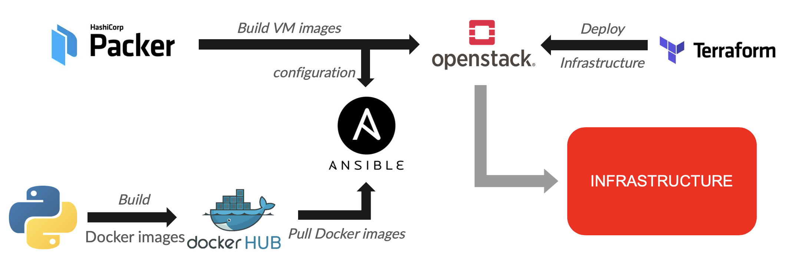
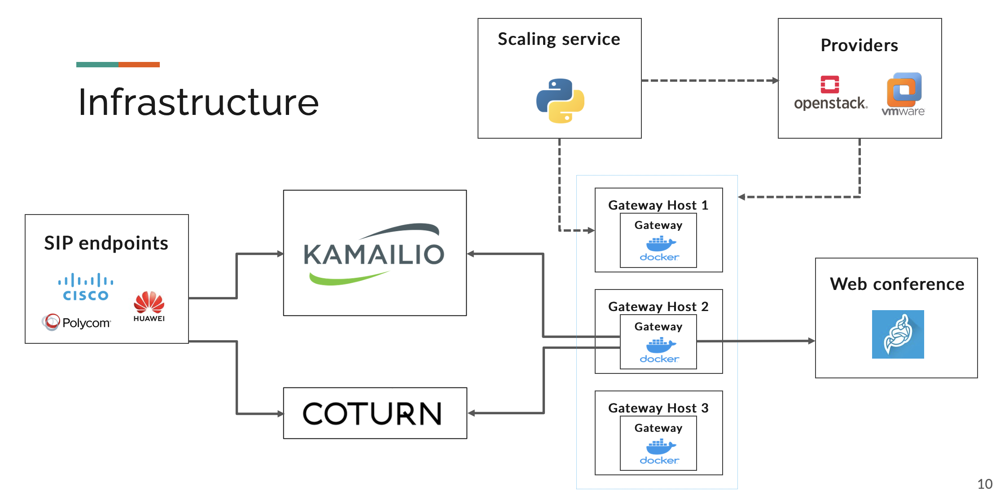
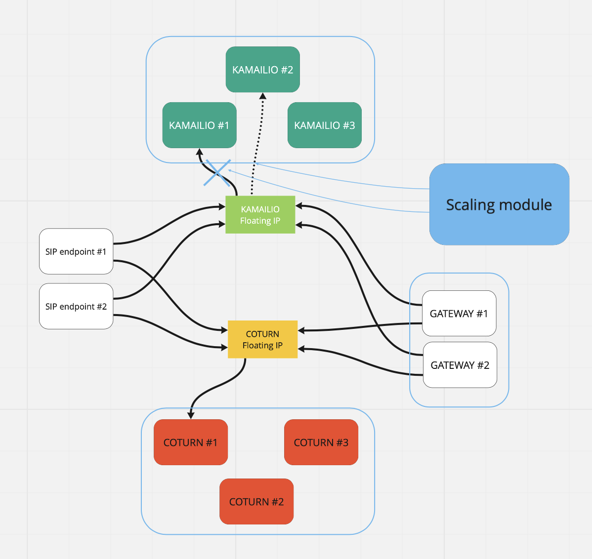

# SIPMediaDeploy in-depth

This document aims at bringing more information about the SIPMediaDeploy project.

## Presentation

This project aims at implementing automatic deployement and redundancy for the [SIPMediaGateway](https://github.com/Renater/SIPMediaGW), which was put in place in order to develop a solution that allows SIP terminals to participate in WebRTC calls.

This solution is currently limited to:
* the use of [Jitsi Meet](https://jitsi.org/jitsi-meet/) for the WebRTC platform.
* the use of [OpenStack](https://www.openstack.org) for the cloud provider.

Of course, this solution can be easily adapted to support other WebRTC platforms and cloud providers.

## Initial Infrastructure

The initial infrastructure for the SIPMediaGateway is detailed in the following schema:

.

We can see that there are 3 important parts:
* the **SIP server**, which is based on [Kamailio](https://www.kamailio.org/w/).
* the **TURN server**, which is based on [Coturn](https://coturn.net).
* the **Gateway Host servers**, which host the Docker based SIP Media Gateways.

In the rest of the project, a choice was made to deploy only one Media Gateway per Gateway Host server, but this can be easily changed using environment variables.

## Automatic deployement

After extensive discussions which involved maintainability and multi-provider support, the used technologies were agreed upon as follows:
* **Ansible** to configure virtual machine images.
* **Packer** to build images and push them to the OpenStack working environment.
* **Terraform** to deploy the whole infrastructure.

The exact worflow for the deployment is detailed in the following schema:

Therefore, in order to deploy the whole infrastructure, we need to:
* build Docker images for the Gateway and the Scaler and push them to Dockerhub.
* build virtual machine images using Packer and Ansible.
* deploy the infrastructure using Terraform.

All commands for this purpose are detailed in the READMEs of each directory of the project.

Note that the Ansible playbooks can be launched independently without using Packer to provision virtual machines.

## Scaling

In order to provide a solution that allows to create Gateway Host servers (and not only that if redundancy is enabled), a scaling solution has to be used. To minimize dependences on the infrastructure, we chose to develop our own scaling module. The whole code is available on [Github](https://github.com/Renater/SimpleScaleVM) (and a detailed functioning of the module is available in the [documentation of the repository](https://github.com/Renater/SimpleScaleVM/blob/main/docs/simplescalevm-in-depth.md)) and the corresponding Docker images are hosted on [Dockerhub](https://hub.docker.com/r/renater/simplescalevm).

Here is the updated infrastructure with the scaling module:

## Redundancy

Given that the Kamailio and Coturn instances play a crucial role in the proper functioning of the stack, a more resilient infrastructure is needed to guarantee a minimal downtime in the event of an incident. That is the reason why each brick of the infrastructure was duplicated and a floating IP system was implemented to ensure successful and rapid failovers.

For example, two instances of Kamailio servers are deployed with the same configuration. The main server has the floating IP address attached to it and the scaling module makes sure that this server is always alive and working. In the case of an issue (for instance the Kamailio service shutting down), the scaling module detaches the floating IP from the faulty instance to the one on standby.

This process is detailed in the following schema:

Besides, the scaling module is also duplicated thanks to a feature that is offered by SimpleScaleVM: a cluster of scaling instances is always running and the role of every instance is defined according to a master/slave paradigm.
